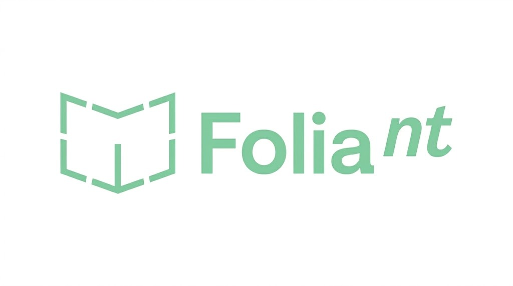

	
  

# Folaint

### Ihr Unternehmenswissen. Strukturiert. Sicher. Sofort nutzbar.

---

## Warum Folaint?

**Folaint** macht das Wissen Ihres Unternehmens auffindbar, nutzbar und zukunftssicher. Statt verstreuter Informationen in SAP, PDFs, E-Mails oder Excel-Dateien erhalten Sie eine zentrale, maschinenlesbare Wissensbasis – als Knowledge Graph, logisch verknüpft und jederzeit abfragbar.

### Ihre Vorteile auf einen Blick

- **Sofort einsatzbereit:** In nur vier Wochen zur validierten, on-premise Wissensbasis.
- **Volle Datensouveränität:** Keine Cloud, keine externen API-Calls – Ihre Daten bleiben bei Ihnen.
- **Keine Halluzinationen:** Deterministische Antworten statt KI-Risiko.
- **Branchen-Templates:** Schnellstart durch erprobte, branchenspezifische Ontologie-Bausteine.
- **Automatisierte Qualität:** Von der Datenextraktion bis zur Validierung – alles aus einer Hand.

---

## So funktioniert Folaint

1. **Ziel-Fragen definieren:** Was soll Ihr Wissensgraph beantworten können?
2. **Daten verbinden:** Strukturierte (z.B. SAP, Excel) und unstrukturierte Quellen (PDFs, E-Mails) werden integriert.
3. **Entitäten & Beziehungen extrahieren:** Modernste KI-gestützte Methoden, aber mit deterministischem Ergebnis.
4. **Validierung & Übergabe:** Sie erhalten eine geprüfte, abfragbare Wissensbasis – inklusive Dokumentation und Query-Bibliothek.

---

## Für wen ist Folaint?

Ideal für produzierende Unternehmen, Banken, Bau und alle, die ihr Wissen sichern und nutzbar machen wollen – ohne Kompromisse bei Sicherheit und Kontrolle.

---

<b>Folaint – Ihr Weg zu einer maschinenlesbaren, sicheren und skalierbaren Wissensbasis.</b>

<i>Kontaktieren Sie uns für eine unverbindliche Demo!</i>

